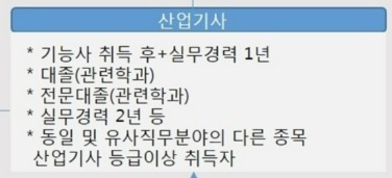
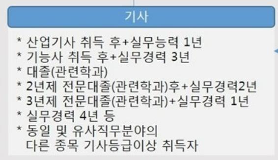

IT / 보안 분야에서 도움이 될 만한 자격증과 시험 목록 정리.

지금까지 땄던 자격증과 앞으로 따고 싶은 자격증, 치뤘던 시험을 IT/보안 분야에서 취업 및 실력에 도움이 될 만한 것들을 골라 정리해 보았다.
물론 내가 넣고 싶어서 넣은 것도 있다.

한국에서 딸 수 있는 자격증 뿐만 아니라 해외 또는 국제 자격증을 포함시켰다.

# 1. 정보처리기능사

- 시행기관 : 한국산업인력공단 (HRD Korea)
- 국가공인여부 : O
- 응시조건
  - 제한없음
- 시험형태
  - 필기 : 객관식 4지택일형
  - 실기 : 필답형(주관식)
- 난이도(주관적) : 하
- 합격기준
  - 필기 : 100점 만점 과목당 40점 이상, 전과목 평균 60점 이상
  - 실기 : 100점 만점 60점 이상
- 자격유지기간 : 영구
- 시험일정
  - 연 4회
- 응시료
  - 필기 : 14500원
  - 실기 : 17200원

본인은 주변 사람들이 IT 분야를 하고 싶다고 하면 이 자격증이 있는지, 딸 계획이 있는지를 가장 먼저 물어본다.
우선 국가공인 자격증이기 때문에, 공공기관, 사기업에서 거의 대부분 이 자격을 인정해 주고, 단순히 따 놓고 방치하기만 해도 그 다음 산업기사/기사 응시 조건을 채울 수 있기 때문이다. (기능사 취득후 n년 경과 + 경력 조건)
그러니 제발, IT쪽을 생각 중인데 아직 이 자격증을 따지 않았다면 나이 상관없이(미성년자도 가능), 조건 없이 일단 이걸 먼저 따보고 생각해 보자.
너무 무작정 영업하는것 같다면, 정보처리기능사 자격증은 시험 공부를 하면서 컴퓨터에 관련된 기초적인 배경지식을 얻을 수 있으므로 시험 전/후 모두 매우 도움되는 자격증이다.
응시료도 매우 싼 축에 속해 부담이 덜하다.(23년 6월 기준)
준비기간은 2주~1달 정도면 충분하다고 한다.

참고로, 2026년부터는 명칭이 프로그래밍기능사로 변경되고, 시험 과목 역시 그에 맞춰 일부 변경될 예정이다.

레퍼런스
 - [정보처리기능사 상세정보](https://www.q-net.or.kr/crf005.do?id=crf00505&jmCd=6921)
 - 프로그래밍기능사 명칭변경 : [국가기술자격법 일부개정 입법예고](https://www.moleg.go.kr/lawinfo/makingInfo.mo?mid=a10104010000&lawSeq=73316&lawCd=0&lawType=TYPE5&currentPage=1&keyField=&keyWord=&stYdFmt=&edYdFmt=&lsClsCd=&cptOfiOrgCd=)

# 2. 정보처리기사 / 정보처리산업기사

- 시행기관 : 한국산업인력공단 (HRD Korea)
- 국가공인여부 : O
- 응시조건 : 하단 사진 참조
- 시험형태
  - 필기 : 객관식 4지택일형
  - 실기 : 필답형(주관식)
- 난이도(주관적) : 중
- 합격기준
  - 필기 : 100점 만점 과목당 40점 이상, 전과목 평균 60점 이상
  - 실기 : 100점 만점 60점 이상
- 자격유지기간 : 영구
- 시험일정
  - 연 3회
- 응시료
  - 산업기사 & 기사 필기 : 19400원
  - 산업기사 실기 : 20800원
  - 기사 실기 : 22600원

이 자격증도 정보처리기능사와 마찬가지로 딸 수 있으면 반드시 따자.
관련 대학 학과를 다니고 있거나, 졸업하였다면 취업 시 가점이 될 확률이 높은 자격증이고, 경력이라면 각종 평가요소 또는 이직에도 유리할 수 있다.  
본인은 가능하면 산업기사보다는 기사 응시가 가능하면 기사 쪽을 권장한다. 난이도 차이가 많이 나지 않는 데 비해 인정받는 수준이 달라지기 때문이다.
그리고 산업기사/기사를 하나 획득하게 되면 동일 및 유사 직무분야의 응시 자격이 주어지기 때문에, 다른 산업기사/기사를 획득하기가 쉬워진다.
본인은 기능사 취득후 + 실무경력 3년 조건으로 시험에 응시하여 합격하였다.

레퍼런스
 - [정보처리산업기사 상세정보](http://www.q-net.or.kr/crf005.do?id=crf00503&jmCd=2290)
 - [정보처리기사 상세정보](https://www.q-net.or.kr/crf005.do?id=crf00503&jmCd=1320)

# 3. 정보보안기사 / 정보보안산업기사

- 시행기관 : 한국방송통신전파진흥원 (KCA)
- 국가공인여부 : O
- 응시조건 : 위 정보처리기사, 산업기사와 각각 동일
- 시험형태
  - 필기 : 객관식 4지선다형
  - 실기 : 필답형(주관식)
- 난이도(주관적) : 중상
- 합격기준
  - 필기 : 100점 만점 과목당 40점 이상, 전과목 평균 60점 이상
  - 실기 : 100점 만점 60점 이상
- 자격유지기간 : 영구
- 시험일정
  - 연 3회 (마지막 회차는 CBT)
- 응시료
  - 산업기사 & 기사 필기 : 18800원
  - 산업기사 실기 : 20200원
  - 기사 실기 : 21900원

정보처리산업기사/기사를 획득한 이후에 노려볼만 하다. 아직 공부한 것을 잊지 않았을 때, 유사한 분야이지만 보안산업기사/기사에서 요구하는 분야는 정보처리산업기사/기사보다 넓기 때문에 처음부터 이 자격증에 도전하는건 상당한 시간을 필요로 할 것이다.
필기는 객관식이라 그래도 할만하지만, 실기는 말이 주관식에 60점 합격이지만 59점 불합격이 많이 나오고, 후기를 봐서는 절대평가를 가장한 상대평가라는 평이 있다.
그래도 자격증 시행처가 2022년부터 한국인터넷진흥원(KISA)에서 한국방송통신전파진흥원(KCA)로 이관되면서 악명높던 실기의 합격률이 다소 완화된 모양새이다. 
본인은 정보처리기사 취득후 동일직무분야 기사 자격으로 시험에 응시하여 합격하였다.

레퍼런스
 - [정보보안산업기사 상세정보](https://www.cq.or.kr/qh_quagm01_019.do), 정보보안산업기사 클릭
 - [정보보안기사 상세정보](https://www.cq.or.kr/qh_quagm01_020.do), 정보보안기사 클릭
 - [시행처 이관](https://www.koit.co.kr/news/articleView.html?idxno=87423)

# 4. Security+

- 시행기관 : CompTIA
- 국가공인여부 : X
- 국제공인여부 : O
- 응시조건 : 없음
- 시험형태
  - 필기
    - 객관식(n지선다) + 몇 개의 시뮬레이션형 질문, 최대 90문제
    - 시험시간 : 90분
    - 시험언어 : 영어, 일본어, 베트남어, 포르투갈어
    - 접수처 : Pearson VUE
    - 현재 시험코드 : SY0-601, 2024년 7월 개정 예정
- 난이도(주관적) : 중하
- 합격기준
  - 100-900점 사이 750점 이상
- 자격유지기간 : 3년
- 시험일정
  - 상시, Pearson VUE를 통한 위탁시험장 일정에 따름 (CBT)
- 응시료
  - 392$ (1$ = 1300원 가정시 약 51만원)
- 자격 유지방법 & 비용
  - CE (Continuing Education) Fee : $150
  - CompTIA CertMaster CE Security+ : $199

해외 자격증이지만 국제 자격증으로 대부분 인정해 주고 있는것 같다.
한국에서는 생소할 것이다. 일단 응시료가 장난 아니다. 환율이 쌀 때도 40만원, 비싸면 50만원이 넘어가는 것을 단 1회 시험을 보기 위해 내야 한다. 불합격시 무료 재응시 그런거 없다.
해외 자격증은 대부분의 응시 접수를 Pearson VUE 라는 업체를 통해 하고 있는 것 같다. 따라서 시험 응시를 하기 위해서는 CompTIA 홈페이지가 아닌 PearsonVUE 홈페이지에서 시험 검색 이후 근처 지역, 가능한 일정을 확인하여 시험 일정을 예약해야 한다.
코로나로 인해 집에서도 볼 수 있다고는 하는데, 추가 감독관 비용을 지불해야 하고, 웹캠이 요구되며, 시험 시작 전 주변 환경 검사, 연결 프로그램 오류 등등 거쳐야 할 것이 많고 문제 발생시 대응이 어려우니 가급적이면 시험장 방문 응시가 권장된다.
해외에서는, 특히 미국 국방부에서는 특정 직무를 하고 있는 사람에게 필수로 요구되는 자격 등급이 있고, 그에 해당하는 자격증이 존재하는데, Security+ 자격증이 이 목록에 포함되어 있다.
문제에서 요구하는 수준은 한국의 기능사 수준이지만, 문제 지문이 영어이다 보니 난이도가 상승한다. 체감상 기능사-산업기사 사이 중 산업기사 쪽에 더 가까운 느낌.
비싼 수험료를 날리기 싫다면 인터넷 검색을 해서 어느 정도 신뢰성 있는 Dump (기출문제, 유출문제)를 구매하여 (10만원 이내) 보는 것을 추천한다.
CompTIA에서 주관하는 시험은 Security+ 말고도 다양한데, CompTIA에서 제공한 자료에 따르면 CompTIA뿐만 아니라 다른 주관 기관의 자격증까지 포함하여 작성한 로드맵 자료가 있다.
비싼 시험에 자격 유효기간은 3년이라 자격 갱신을 하고 싶다면 여러 가지 방법들을 이용하여 자격 갱신을 해야 하는데, 이것도 무료는 아니다. 학회나 세미나, 출판물 등등을 통해 CE (Continuing Education) 를 획득하고, 그것을 인정받기 위한 수수료(Fee) 를 총합 150달러를 지불하느니, 필자는 CompTIA CertMaster CE Security+ 를 구매하여 해당 교육 과정 및 테스트 수료를 통해 자격 갱신하는 것을 추천한다.
일단 온라인이고, 다른 방법에 비해 복잡하지 않으며, 단기간 내에 과정을 완료할 수 있다는 장점이 있다.

레퍼런스
 - [Security+ 상세정보](https://www.comptia.org/certifications/security#examdetails)
 - [CompTIA CertMaster CE Security+ 상세정보](https://www.comptia.org/continuing-education/choose/renew-with-a-single-activity/complete-a-comptia-certmaster-ce-course#security)
 - [DoD 8570.01 미 국방부 정보/사이버보안 역할별 요구사항](https://public.cyber.mil/wid/cwmp/dod-approved-8570-baseline-certifications/)
 - [CompTIA 제공 로드맵](https://twitter.com/CompTIA/status/1182670202762420225/photo/1)

# 5. CISSP

- 시행기관 : (ISC)²
- 국가공인여부 : X
- 국제공인여부 : O
- 응시조건
  - CISSP CBK (Common Body of Knowledge) 8개 도메인 중 2개 이상에서 최소 5년 이상의 누적 경력 (필수)
  - 4년제 대학 학위 or 지역별 동등 학위 취득, (ISC)² 승인 리스트 내 추가 자격 소지시 1년의 요구 경력 충족 가능 (선택)
  - 교육 크레딧으로는 1년의 경력만을 인정
  - 필수 요구사항 미충족시에도 CISSP 시험에 합격하면 Associate of (ISC)² 자격이 주어지고, 5년의 경력을 쌓을 수 있도록 6년의 시간이 주어짐
- 시험형태
  - 필기 / 선형(Linear) 방식 (CBT)
    - 250문제, 6시간
    - 객관식(n지선다) + 몇 개의 시뮬레이션형 질문
  - 필기 / CAT 방식 (CBT)
    - 영어 시험에 한해 제공되고, 23년 6월 기준 한국에서 응시 가능한 시험장 없음. (외국으로 가야 응시가능)
    - CAT : Computerized Adaptive Testing
    - 125 ~ 175문제, 4시간
    - 객관식(n지선다) + 몇 개의 시뮬레이션형 질문
- 난이도(주관적) : 상
  - Disclaimer : 필자는 아직 이 시험을 응시한 적이 없습니다. 주변의 후기, 인터넷 자료를 참고하여 평가한 것으로 정확성을 보장하지 않습니다.
- 합격기준
  - 총점 1000점 중 700점 이상
- 자격유지기간 : 3년
- 시험일정
  - 상시, Pearson VUE를 통한 위탁시험장 일정에 따름 (CBT)
- 응시료
  - 799$ (1$ = 1300원 가정시 약 104만원)
- 자격 유지방법 & 비용
  - 

레퍼런스
 - [CISSP 상세정보](https://www.isc2.org/Certifications/cissp/Certification-Exam-Outline)
 - [CISSP 시험 개요](https://www.isc2.org/-/media/ISC2/Certifications/Exam-Outlines/CISSP-Exam-Outline-English-April-2021.ashx)
 - 

# 6. CISA

# 7. CCSP

# 8. CEH

# 9. GPEN

# 10. CCNP

# 11. AWS Solution Architecture

# 12. TOPCIT
 

# 참고한 웹페이지 목록
- [지금 공부해 두면 당장은 물론 앞으로도 도움이 될 만한 IT/보안 자격증](https://www.boannews.com/media/view.asp?idx=107666)
- [2020년 정보보호 인력 취업시장, 당락 좌우할 ‘자격증’ 어떤 게 있을까](https://www.boannews.com/media/view.asp?idx=86987&page=3&kind=3)
- [[주말판] 난립하는 보안 자격증들 중 투자 효용이 높은 것 12](https://www.boannews.com/media/view.asp?idx=98439&page=2&kind=1)